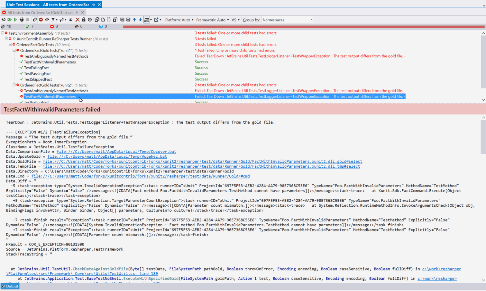

## DiffGold ##

DiffGold is a nice ReSharper extension. It's core audience is ReSharper plugin developers. Possibly even the ReSharper dev team.

It's single purpose is to make it a little easier to work with ReSharper's test acceptance framework. This framework allows you to write tests for your ReSharper extension by hosting an in-memory ReSharper environment, loading up a project and performing an action on a file, such as invoking code completion, or running code cleanup. The output of the action is saved in a temporary file and compared against a "gold" file. If it matches, the test passes, if it doesn't, it fails. See the [plugin development guide](http://confluence.jetbrains.com/display/NETCOM/2.10+Testing+%28R8%29) for more info.

This extension will add a few new buttons to the unit test session toolbar. Normally, they will appear to be disabled, but when you select a failing acceptance test, they will enable, allowing you to easily diff the results, edit the gold or temp file, or update the gold. The diff will appear in Visual Studio's diff viewer, and the files will be opened to edit in Visual Studio windows.

### How does it work? ###

Regular expressions. Oh yes.

Normally, when comparing the files, ReSharper will throw an exception if they don't match. When it does so, it makes use of a little known feature of the `Exception` class - the `Data` dictionary property. This is just a simple dictionary that you can use to store anything in.

ReSharper uses it to store context about the exception, and when reporting an exception, it will output the `Data` dictionary as well as the `Message` and `StackTrace`.

Incidentally, ReSharper does this for most exceptions it throws in the product. However, this context is only added in "checked" builds. If you're building plugins, you should [install a checked build](http://resharper-support.jetbrains.com/entries/21206508-Where-can-I-download-an-old-previous-ReSharper-version-) instead of the production build. It's exactly the same codebase, but compiled with debug asserts enabled, more logging, added context to the exceptions, and exception logging is enabled by default. The SDK binaries that tests will run against are also a checked build, so you'll see this information by default when using the SDK nugets.

The information in the `Data` dictionary for the gold files includes the gold and temp file paths, as clickable `file://` URLs, and also links to `.bat` files to update the gold file, or diff it with [kdiff3](http://kdiff3.sourceforge.net/).

This extension will use regular expressions looking for these links. If it finds them, it enables the button, and uses the gold path and temp path to diff, edit or update. The links still work, if you want to use them.

As another aside, it's possible to override the default choice of kdiff3. You need to set the `DIFF` environment variable to the executable of the diff program, and then set the `DIFF_PARAMETERS` environment variable to specify the parameters. The values are substituted in, replacing `$parent` and `$child` with the temp and gold file paths, and the `$plabel1` and `$clabel` strings with the name of the temp and gold files respectively.

It wasn't possible to edit the variables to reliably open the diff in the current Visual Studio instance, so, hey, let's write a plugin.

E.g.:

WinMerge:

    set DIFF=C:\Program Files (x86)\WinMerge\WinMergeU.exe
    set DIFF_PARAMETERS= /wl /dl '$plabel1' /dr '$clabel' $parent $child

SourceGear DiffMerge:

    set DIFF=C:\Program Files\SourceGear\Common\DiffMerge\sgdm.exe
    set DIFF_PARAMETERS= -t1 '$plabel1' -t2 '$clabel' $parent $child

Beyond Compare 3:

    set DIFF=C:\Program Files (x86)\Beyond Compare 3\BCompare.exe
    REM Doesn't seem to work when specifying titles?
    set DIFF_PARAMETERS= /lro $parent $child
    REM set DIFF_PARAMETERS= /lro /title1 '$plabel1' /title2 '$clabel' $parent $child

Beyond Compare 4:

    set DIFF=C:\Program Files (x86)\Beyond Compare 4\BCompare.exe
    REM Doesn't seem to work when specifying titles?
    set DIFF_PARAMETERS= /lro $parent $child
    REM set DIFF_PARAMETERS= /lro /title1 '$plabel1' /title2 '$clabel' $parent $child

You can even set these from within the NuGet PowerShell console, but remember to escape the dollar signs with a backtick:

    $env:DIFF=sgdm
    $env:DIFF_PARAMETERS= -t1 '`$plabel1' -t2 '`$clabel' `$parent `$child
